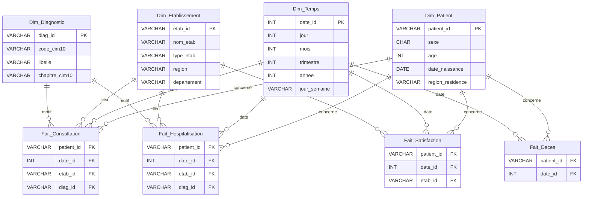

# Dimensions partagées — Cloud Healthcare Unit

> **Livrable** : `[COMMUN] Modélisation des dimensions partagées` (Phase commune J1–J2)
> **Auteur** : Matthieu (P3)
> **Statut** : **VALIDÉ** — décisions de modélisation arrêtées et figées comme référentiel commun. Toute évolution passe par une mise à jour de ce document (voir §8).

## 1. Objectif

Définir **une seule version de la vérité** pour les 4 dimensions communes à tous les axes
métier (P1 décès / hospitalisation, P2 établissements / professionnels, P3 satisfaction).
Ces dimensions sont **conformes** : elles sont partagées par les 4 tables de faits du modèle
en étoile et garantissent que personne ne réinvente sa propre `Dim_Patient`.

Sources du projet (énoncé *Cloud Healthcare Unit*) :

| Source | Contenu | Format |
|---|---|---|
| BDD PostgreSQL | Soins médico-administratifs des patients (consultations) | SQL |
| Export établissements | Établissements hospitaliers de France (FINESS) | CSV |
| Fichiers satisfaction | Notes de satisfaction patients par établissement (e-Satis / IQSS) | CSV plats |
| Répertoire des décès | Décès en France (INSEE) | CSV / fichier plat |

## 2. Conventions

- **Clés techniques** : chaque dimension expose une clé primaire stable et indépendante des
  systèmes sources. `patient_id` est un **hash SHA-256** (anonymisation RGPD des données
  médicales). `etab_id` reprend le **FINESS**, `diag_id` est dérivé du **code CIM-10**.
- **Type physique cible** : Hive / entrepôt distribué (voir Livrable 2). Les types ci-dessous
  sont logiques (MCD/MLD) ; le mapping Hive est précisé en colonne *Type physique*.
- **Valeurs nulles** : `NULL` autorisé uniquement là où la colonne *Nullable* = Oui.
- **Harmonisation** : les codes hétérogènes entre sources sont normalisés à l'ETL
  (ex. `sexe` codé `1/2` dans le fichier décès → `M/F`).

---

## 3. Dictionnaire de données

### 3.1 Dim_Patient

Identité anonymisée du patient. Alimentée par la BDD PostgreSQL (soins) et recoupée avec le
répertoire des décès.

| Attribut | Type logique | Type physique (Hive) | Contrainte | Nullable | Description / Source |
|---|---|---|---|---|---|
| `patient_id` | VARCHAR(64) | STRING | **PK** | Non | Hash SHA-256 de l'identité patient (anonymisation) |
| `sexe` | CHAR(1) | STRING | CHECK ∈ {M, F} | Non | Sexe. Décès source = `1`→M, `2`→F (harmonisé ETL) |
| `age` | INT | INT | ≥ 0 | Oui | Âge en années (calculé à la date de l'événement) |
| `date_naissance` | DATE | DATE | — | Oui | Date de naissance (source décès : `date_naissance`) |
| `region_residence` | VARCHAR(60) | STRING | — | Oui | Région de résidence (dérivée du code lieu INSEE) |

> Règle : `age` est dérivé de `date_naissance` ; on conserve les deux pour répondre aux
> besoins « par âge » et autoriser le calcul à la date d'événement.

### 3.2 Dim_Temps

Calendrier de référence, généré (pas de source : table construite). Permet tous les filtres
« sur une période de temps Y » et les agrégats par trimestre / année (besoin satisfaction 2020,
décès 2019).

| Attribut | Type logique | Type physique (Hive) | Contrainte | Nullable | Description |
|---|---|---|---|---|---|
| `date_id` | INT | INT | **PK** | Non | Clé au format `YYYYMMDD` (ex. 20200115) |
| `jour` | INT | INT | 1–31 | Non | Jour du mois |
| `mois` | INT | INT | 1–12 | Non | Mois |
| `trimestre` | INT | INT | 1–4 | Non | Trimestre |
| `annee` | INT | INT | — | Non | Année |
| `jour_semaine` | VARCHAR(10) | STRING | — | Non | Libellé jour (Lundi…Dimanche) |

### 3.3 Dim_Etablissement

Établissements de santé, alimentée par l'export FINESS (`etablissement_sante.csv`).

| Attribut | Type logique | Type physique (Hive) | Contrainte | Nullable | Description / Source |
|---|---|---|---|---|---|
| `etab_id` | VARCHAR(20) | STRING | **PK** | Non | FINESS site (`finess_site`) |
| `nom_etab` | VARCHAR(255) | STRING | — | Oui | `raison_sociale_site` / enseigne commerciale |
| `type_etab` | VARCHAR(50) | STRING | — | Oui | CHU, clinique, hôpital privé, HAD… (catégorie FINESS) |
| `region` | VARCHAR(60) | STRING | — | Oui | Région (dérivée du `code_postal` / `code_commune`) |
| `departement` | VARCHAR(60) | STRING | — | Oui | Département (2–3 premiers chiffres du code postal) |

> Note : la jointure inter-sources se fait via le FINESS. Les hospitalisations utilisent
> `identifiant_organisation` (= FINESS, ex. `F010000107`) → rapprochement à valider à l'ETL.

### 3.4 Dim_Diagnostic

Référentiel des diagnostics CIM-10, alimenté par le champ `Code_diagnostic` des
hospitalisations et des soins (consultations).

| Attribut | Type logique | Type physique (Hive) | Contrainte | Nullable | Description / Source |
|---|---|---|---|---|---|
| `diag_id` | VARCHAR(20) | STRING | **PK** | Non | Clé diagnostic (= code CIM-10 normalisé) |
| `code_cim10` | VARCHAR(10) | STRING | — | Non | Code CIM-10 (ex. `S02800`, `Q902`, `M1125`) |
| `libelle` | VARCHAR(255) | STRING | — | Oui | Libellé (source : `Suite_diagnostic_consultation`) |
| `chapitre_cim10` | VARCHAR(120) | STRING | — | Oui | Chapitre CIM-10 (lettre initiale → grande famille) |

---

## 4. Relations dimensions → tables de faits

Modèle en **étoile**. Les 4 dimensions partagées sont reliées aux 4 futures tables de faits
(une par axe métier). Chaque fait référence les dimensions par clé étrangère.

| Fait \ Dimension | Dim_Patient | Dim_Temps | Dim_Etablissement | Dim_Diagnostic | Source |
|---|:---:|:---:|:---:|:---:|---|
| **Fait_Consultation** | ✅ | ✅ | ✅ | ✅ | BDD PostgreSQL (soins) |
| **Fait_Hospitalisation** | ✅ | ✅ | ✅ | ✅ | `Hospitalisations.csv` |
| **Fait_Satisfaction** | ✅ | ✅ | ✅ | — | Fichiers e-Satis / IQSS |
| **Fait_Deces** | ✅ | ✅ | — | — | Répertoire décès INSEE |

Cardinalités (notation crow's foot) : `Dim (1) —— (N) Fait`.
Une ligne de fait pointe vers **exactement une** occurrence de chaque dimension qui la concerne ;
une occurrence de dimension peut être référencée par **N** lignes de faits.

Ces relations couvrent les besoins utilisateurs de l'énoncé :

- Taux de consultation par établissement / période → Fait_Consultation × Etab × Temps
- Taux de consultation par diagnostic / période → Fait_Consultation × Diagnostic × Temps
- Taux d'hospitalisation global / par diagnostic / par sexe / par âge → Fait_Hospitalisation × {Temps, Diagnostic, Patient}
- Taux de consultation par professionnel → Fait_Consultation (Dim_Professionnel, hors périmètre dimensions partagées — propre à P2)
- Nombre de décès par région / année 2019 → Fait_Deces × Patient(region) × Temps
- Taux de satisfaction par région / année 2020 → Fait_Satisfaction × Etab(region) × Temps

> Remarque : `Dim_Professionnel` (besoin « taux de consultation par professionnel ») n'est
> **pas** une dimension partagée — elle est spécifique à l'axe soins/professionnels (P2) et
> sera modélisée dans le livrable correspondant.

## 5. Schéma MCD (vue ER)

Diagramme éditable : **`mcd_dimensions_partagees.drawio`** (ouvrir avec draw.io / diagrams.net).
Vue Mermaid équivalente ci-dessous (rendue par les viewers Markdown/Drive) :

## 6. Décisions de modélisation arrêtées

Ces choix sont **figés** pour l'ensemble de l'équipe (référentiel commun). Ils tranchent les
points ouverts et s'imposent à L1 (modélisation des faits) et L2 (DDL).

| # | Décision | Justification |
|---|---|---|
| D1 | `patient_id` = **hash SHA-256** de l'identité patient (clé technique STRING). | Anonymisation RGPD obligatoire sur données médicales ; clé stable et indépendante des sources, recoupable entre soins et décès sans exposer l'identité réelle. |
| D2 | `sexe` stocké en **`CHAR(1)` ∈ {M, F}** ; mapping ETL `1 → M`, `2 → F` pour le fichier décès. | Une seule représentation dans l'entrepôt ; l'hétérogénéité des sources est absorbée au chargement, pas dans les requêtes BI. |
| D3 | Rapprochement établissements **via le FINESS** : `etab_id = finess_site` ; `Hospitalisations.identifiant_organisation` est traité comme un FINESS et joint sur cette clé. | Le FINESS est l'identifiant national pivot ; évite les jointures fragiles sur le nom d'établissement. |
| D4 | `region` / `departement` **dérivés** du `code_postal` / `code_commune` (Etab) et du code lieu INSEE (Patient) à l'ETL. | Les sources ne fournissent pas la région en clair ; dérivation centralisée → cohérence des agrégats « par région ». |
| D5 | `Dim_Professionnel` **exclue** des dimensions partagées. | Besoin « taux de consultation par professionnel » spécifique à l'axe soins/pro (P2) ; pas partagé par les 4 faits → reste hors de ce référentiel commun. |
| D6 | `age` **et** `date_naissance` conservés dans `Dim_Patient`. | `date_naissance` = source de vérité ; `age` matérialisé pour les analyses « par âge » et calculable à la date d'événement. |
| D7 | Granularité des faits = **une ligne par événement** (consultation, hospitalisation, recueil de satisfaction, décès). | Grain le plus fin → tous les taux demandés se calculent par agrégation, sans pré-agrégation figée. |

## 7. Definition of Done

- [x] 4 dimensions documentées (attribut, type, contrainte)
- [x] MCD dessiné avec relations vers les 4 faits (`.drawio` + `.png` + Mermaid)
- [x] Validation — décisions de modélisation arrêtées (§6) et figées comme référentiel commun
- [x] Document partagé sur le drive (déposé dans `Bloc - Big Data/Modelisation/` sur ProtonDrive)

## 8. Impact aval (à respecter par toute l'équipe)

Cette modélisation **bloque** : toutes les modélisations de faits (L1) et tous les DDL (L2).
Toute évolution d'un attribut de dimension doit être répercutée ici **avant** d'être codée
dans les DDL Hive, pour préserver l'unicité de la vérité.
