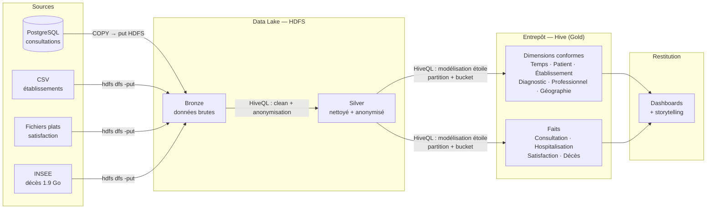

# Livrable 1 — Architecture & choix des outils

Projet **Cloud Healthcare Unit (CHU)** — entrepôt de données décisionnel pour l'exploitation des données de santé.

## 1. Cadrage (kick-off)

**Objectif** : concevoir et constituer l'entrepôt de données décisionnel du groupe CHU pour répondre aux 8 besoins d'analyse des utilisateurs (consultations, hospitalisations, satisfaction, décès).

**Périmètre du Livrable 1** : conceptuel — modèle de données (faits + dimensions), description des jobs d'alimentation, architecture. L'implémentation physique relève du Livrable 2.

## 2. Sources de données

| Source | Type | Volumétrie | Sujet couvert |
|--------|------|-----------|---------------|
| BDD PostgreSQL | Base relationnelle | 45 Mo | Soins médico-administratifs (consultations) |
| Établissements de santé | CSV | 203 Mo | Référentiel des établissements de France |
| Satisfaction | Fichiers plats | 16 Mo | Notes de satisfaction patients |
| Décès en France | Fichiers INSEE | 1,9 Go | Répertoire national des décès |

La volumétrie du répertoire des décès (1,9 Go) justifie une approche distribuée plutôt qu'un simple SGBD relationnel.

## 3. Architecture cible

Architecture en **médaillon** (Bronze → Silver → Gold) sur socle Hadoop local.

**Les 3 zones :**

- **Bronze** — copie brute des sources sur HDFS, aucune transformation (reprise et audit possibles).
- **Silver** — données nettoyées, dédupliquées et **anonymisées** (pseudonymisation des patients dès cette couche, conformément à l'exigence de sécurité).
- **Gold** — modèle en **étoile** (faits + dimensions conformes), tables Hive **partitionnées et bucketées** pour la performance.

## 4. Choix des outils et justification

Critères imposés par le sujet : **coût-efficacité, sécurité, élasticité, scalabilité**.

| Couche | Outil retenu | Justification |
|--------|-------------|---------------|
| Stockage | **HDFS (local)** | Distribué, tolérant aux pannes, scalable horizontalement, open-source |
| Ingestion | **`hdfs dfs -put` + `COPY`** | Suffisant pour ~2 Go ; pas de moteur lourd inutile |
| ETL / Traitement | **HiveQL (batch)** | Hive assure aussi la transformation en SQL ; un seul moteur à maîtriser |
| Entrepôt | **Hive (local)** | Partitionnement et bucketing **natifs**, métastore, SQL standard, connecteurs BI |
| Format fichier | **Parquet** | Colonnaire et compressé → coût de stockage réduit, requêtes plus rapides |
| Sécurité | Pseudonymisation + gouvernance | Anonymisation des patients en couche Silver |
| Visualisation | **Power BI** / **Tableau** | Connexion Hive (JDBC/ODBC), orientés dashboard et storytelling |

**Décisions structurantes :**

- **Spark écarté** : à ~2 Go, un moteur distribué dédié au traitement est surdimensionné. Hive assure directement l'ETL en SQL, ce qui simplifie le stack et colle au vocabulaire du sujet (partitionnement + buckets = concepts Hive).
- **Traitement 100 % batch** : les sources sont des dumps historiques statiques ; le streaming n'apporte rien et serait incompatible avec l'écriture bucketée.
- Les scripts ETL `.hql` constituent directement les livrables du Livrable 2 (création/chargement + partitionnement/buckets).

## 5. Répartition de l'équipe

Un membre = un fait + son job ETL.

| Membre | Fait | Source principale |
|--------|------|-------------------|
| Julian | Fait_Consultation | PostgreSQL |
| Chloé | Fait_Hospitalisation | PostgreSQL |
| Matthieu | Fait_Satisfaction | Fichiers plats |
| Maxime | Fait_Deces | INSEE (volumétrie) |

Les dimensions conformes sont modélisées en commun avant le travail parallèle sur les faits.
