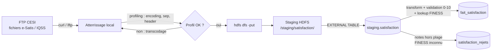

# Job ETL Satisfaction (Livrable 1)

> **Tâche** : `[P3] Description job ETL Satisfaction` (869dfg12k)
> **Auteur** : Matthieu (P3)
> **Prérequis** : [Modélisation Fait_Satisfaction](L1_Modelisation_Fait_Satisfaction.md) + `Dim_Etablissement` chargée

## 1. Contexte et spécificité

La source Satisfaction est constituée de **fichiers plats déposés sur le FTP CESI** (open data
e-Satis / IQSS, un fichier par campagne annuelle). Contrairement aux autres axes (extraction
SQL homogène depuis PostgreSQL), ces fichiers sont **hétérogènes d'une année à l'autre** :
encodage, séparateur, nombre de colonnes et libellés varient. Une étape de **profiling** est
donc **obligatoire avant l'ingestion** — sans elle, le parsing casse silencieusement
(mojibake sur les régions, colonnes décalées).

## 2. Vue d'ensemble du job



## 3. Étape 1 — Profiling du fichier (obligatoire)

Résultats du profiling réel sur `DATA 2024/Satisfaction/` (à refaire à chaque nouvelle
campagne) :

| Caractéristique | Constat | Action ETL |
|---|---|---|
| **Encoding** | **ISO-8859-1 / CP1252** (Latin-1), *pas* UTF-8 — les libellés régions ressortent en mojibake si lus en UTF-8 (`Auvergne-Rh�ne-Alpes`) | Transcodage systématique `iconv -f CP1252 -t UTF-8` avant ingestion |
| **Séparateur** | point-virgule `;` | `FIELDS TERMINATED BY ';'` |
| **Fin de ligne** | CRLF (`\r\n`) | normaliser en `\n` (`tr -d '\r'`) |
| **En-tête** | présent (1 ligne) | `tblproperties("skip.header.line.count"="1")` |
| **Colonnes clés** | `finess`, `region`, `score_all_rea_ajust`, `participation` (23 à 25 colonnes selon l'année) | ne charger que les colonnes utiles |
| **Échelle mesure** | score global **0–100** (moy. ≈ 73.7) | normaliser `/10` → 0–10 |

Commande de profiling reproductible :

```bash
F=resultats-esatis48h-mco-open-data-2020.csv
file "$F"                      # encoding + terminaison de ligne
head -1 "$F" | tr ';' '\n'     # liste des colonnes
iconv -f CP1252 -t UTF-8 "$F" | head -10   # échantillon lisible
```

## 4. Étape 2 — Ingestion FTP → Staging HDFS

```bash
# 2.1 Récupération depuis le FTP CESI
curl -u "$FTP_USER:$FTP_PWD" \
     "ftp://ftp.cesi.fr/satisfaction/resultats-esatis48h-mco-open-data-2020.csv" \
     -o /tmp/satisfaction_2020.csv

# 2.2 Normalisation encoding + fins de ligne (issu du profiling §3)
iconv -f CP1252 -t UTF-8 /tmp/satisfaction_2020.csv | tr -d '\r' \
     > /tmp/satisfaction_2020_utf8.csv

# 2.3 Dépôt en zone de staging HDFS (Bronze)
hdfs dfs -mkdir -p /staging/satisfaction/
hdfs dfs -put -f /tmp/satisfaction_2020_utf8.csv /staging/satisfaction/
```

## 5. Étape 3 — Transformation et alimentation du fait

La table externe de staging et l'`INSERT` de chargement sont détaillés dans
[`etl/load_satisfaction.sql`](../etl/load_satisfaction.sql) (Livrable 2). Logique :

1. **Parsing** via `EXTERNAL TABLE` pointant sur `/staging/satisfaction/`.
2. **Validation** : ne garder que les notes dans `[0, 10]` après normalisation `/10`.
3. **Lookup `Dim_Etablissement`** : `etab_id` (= FINESS) doit exister dans la dimension — sinon
   la ligne part en rejet.
4. **`INSERT INTO fait_satisfaction`** des lignes valides.

## 6. Gestion d'erreurs

| Cas d'erreur | Détection | Traitement |
|---|---|---|
| Note hors plage `[0,10]` (ou score brut hors `[0,100]`) | `WHERE note BETWEEN 0 AND 10` | rejet → table `satisfaction_rejets`, motif `NOTE_HORS_PLAGE` |
| Note manquante / non numérique | `note IS NULL` après `CAST` | rejet → motif `NOTE_NULLE` |
| FINESS absent de `Dim_Etablissement` | `LEFT JOIN ... WHERE e.etab_id IS NULL` | rejet → motif `ETAB_INCONNU` |
| Doublon établissement × date | `GROUP BY` / `ROW_NUMBER` | conservation de la dernière, log du doublon |

Les rejets sont **comptés et tracés** (le rapport de vérification du chargement reprend ces
volumes). Un taux de rejet anormal (> quelques %) signale un problème de profiling en amont.

## 7. Definition of Done

- [x] Étape de profiling documentée (encoding, séparateur, header, échantillon)
- [x] Schéma du job dessiné (§2)
- [x] Étapes détaillées (profiling → ingestion → transformation)
- [x] Gestion d'erreurs documentée (§6)

## 8. Dépendances

- **Prérequis** : modèle `Fait_Satisfaction` + `Dim_Etablissement` chargée (FINESS).
- **Bloque** : [`[P3] Chargement Fait_Satisfaction`](../etl/load_satisfaction.sql) (869dfg1fp).
