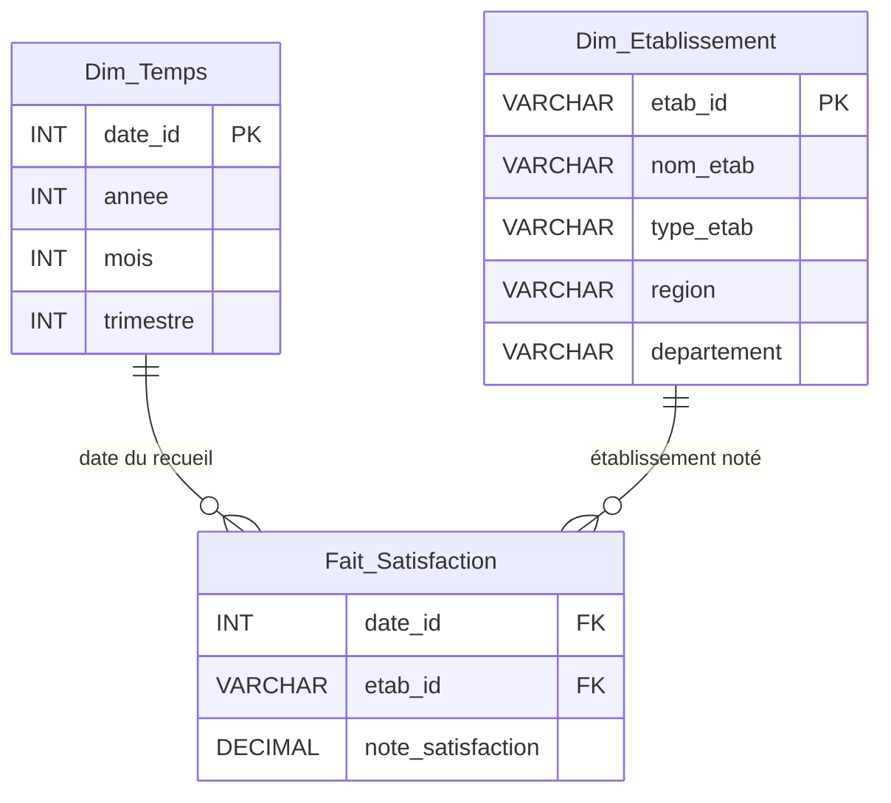

# Fait_Satisfaction — Modélisation (Livrable 1)

> **Tâche** : `[P3] Modélisation Fait_Satisfaction` (869dfg11y)
> **Auteur** : Matthieu (P3)
> **Axe métier** : Satisfaction patients — **KPI 8** : taux de satisfaction par région sur 2020
> **Prérequis** : [Dimensions partagées](02-dimensions-partagees.md) (validées, figées)

## 1. Contexte

P3 modélise `Fait_Satisfaction`. La source est **différente** des autres faits : ce ne sont
pas des données extraites d'une BDD relationnelle mais des **fichiers plats** (open data
e-Satis / IQSS, un fichier par campagne annuelle). L'extraction et le profiling sont donc
spécifiques (voir [Job ETL Satisfaction](L1_Description_Job_ETL_Satisfaction.md)).

Le seul besoin utilisateur couvert par cet axe est le **KPI 8** :

> *Taux global de satisfaction par région sur l'année 2020.*

## 2. Réalité de la source (profiling réel)

Profiling effectué sur les fichiers `DATA 2024/Satisfaction/` (e-Satis 48h MCO) :

| Constat | Valeur observée | Conséquence modèle |
|---|---|---|
| Identifiant établissement | `finess` (ex. `010780054`) | → FK `etab_id` (= FINESS, clé conforme `Dim_Etablissement`) |
| Région | `region` en clair (17 régions) | Pas stockée dans le fait → **déduite via `Dim_Etablissement`** |
| Mesure de satisfaction | `score_all_rea_ajust` (score global ajusté) | → mesure `note_satisfaction` |
| Échelle réelle de la mesure | **0–100** (min 61.9 / max 84.7 / moy 73.7 sur 2019) | Normalisée `/10` → **0–10** (voir D-S2) |
| Granularité du fichier | 1 ligne = 1 établissement × 1 campagne annuelle | Grain = 1 note par établissement et par date de recueil |
| Niveau patient | **absent** (données agrégées/anonymes par établissement) | → **pas de lien `Dim_Patient`** (voir D-S1) |

## 3. Schéma en étoile

`Fait_Satisfaction` est la table de faits **la plus simple** du modèle : 1 mesure, 2 clés
étrangères, aucune dépendance à `Dim_Patient` ni `Dim_Diagnostic`.



Cardinalités (crow's foot) : `Dim (1) —— (N) Fait`.

## 4. Dictionnaire de la table de faits

| Attribut | Type physique (Hive) | Rôle | Contrainte | Source / dérivation |
|---|---|---|---|---|
| `satisfaction_key` | BIGINT | **Clé technique (surrogate)** | unique | `ROW_NUMBER()` au chargement |
| `date_id` | INT | **FK** → `Dim_Temps` | format `YYYY0101` (**grain annuel**) | année de campagne (la source n'a pas de date) |
| `etab_id` | STRING | **FK** → `Dim_Etablissement` | = FINESS **site** | colonne `finess_geo` du fichier e-Satis |
| `geo_id` | STRING | **FK** → `Dim_Geographie` | code région | région établissement → `ref_dept_region` (axe B8 = B7) |
| `note_satisfaction` | DECIMAL(3,1) | **Mesure** | ∈ [0.0, 10.0] | `score_all_rea_ajust / 10` |

- **Grain** : 1 ligne = 1 note de satisfaction pour 1 établissement et 1 **campagne annuelle**.
- **Anonymisation** : la date est ramenée à l'**année de campagne** (`YYYY0101`), grain annuel —
  aucune date fine n'est conservée, conformément à la règle « date avis → arrondir » de
  [`Securite_Anonymisation_NFR.md`](Securite_Anonymisation_NFR.md) §2.2.D.
- **Mesure** : `note_satisfaction` est **additive par moyenne** (on agrège avec `AVG`, jamais
  `SUM`) — c'est une note, pas un compteur.

## 5. Mapping vers le KPI 8

> KPI 8 — Taux global de satisfaction par région sur 2020.

La région n'est **pas** dans le fait : elle est portée par `Dim_Etablissement`. Le KPI se
calcule par jointure + agrégation :

```sql
SELECT e.region,
       ROUND(AVG(f.note_satisfaction), 2) AS satisfaction_moyenne
FROM   fait_satisfaction f
JOIN   dim_etablissement e USING (etab_id)
WHERE  CAST(SUBSTR(CAST(f.date_id AS STRING), 1, 4) AS INT) = 2020
GROUP  BY e.region;
```

Ce mapping confirme que les 2 FK (Temps pour le filtre `2020`, Établissement pour le `GROUP BY
region`) suffisent à couvrir le besoin — aucune autre dimension n'est nécessaire.

## 6. Décisions de modélisation (spécifiques à l'axe Satisfaction)

| # | Décision | Justification |
|---|---|---|
| **D-S1** | **Pas de lien vers `Dim_Patient`.** | La source e-Satis est agrégée **par établissement** ; il n'existe aucun identifiant patient. Les notes sont anonymes par construction → aucun grain patient à représenter. |
| **D-S2** | **Pas de lien vers `Dim_Diagnostic`.** | La satisfaction est mesurée **globalement** au niveau de l'établissement, indépendamment du motif de soin. Aucun code diagnostic dans la source. |
| **D-S3** | Mesure `note_satisfaction` en **DECIMAL(3,1) sur [0,10]**, obtenue par `score_all_rea_ajust / 10`. | Respecte la convention d'équipe (note 0–10, `DECIMAL(3,1)`). Le score natif e-Satis est sur 0–100 ; la normalisation `/10` est faite à l'ETL. *Alternative si l'équipe préfère l'échelle native : `DECIMAL(4,1)` sur [0,100].* |
| **D-S4** | `region` **non dénormalisée** dans le fait. | Évite la redondance et les incohérences ; la région reste l'attribut conforme de `Dim_Etablissement` (cohérent avec les autres axes). |

> **Écart à signaler à l'équipe** : la matrice en bus de `02-dimensions-partagees.md` (§4) liste
> encore `Fait_Satisfaction × Dim_Patient`. Compte tenu de la réalité de la source (agrégat par
> établissement), **ce lien est abandonné** (D-S1). La matrice commune doit être mise à jour :
> `Fait_Satisfaction` ne référence que `Dim_Temps` et `Dim_Etablissement`.

## 7. Definition of Done

- [x] Mesure définie avec son type (`note_satisfaction DECIMAL(3,1)`)
- [x] Choix de ne **pas** lier `Dim_Patient` / `Dim_Diagnostic` justifié (D-S1, D-S2)
- [x] Schéma en étoile dessiné (Mermaid §3)
- [x] Mapping vers le KPI 8 validé (§5)

## 8. Impact aval

Bloque : [`[P3] DDL Fait_Satisfaction`](../ddl/fait_satisfaction.sql) (869dfg1fa).
La granularité et les types fixés ici s'imposent au DDL L2 et au job ETL.
