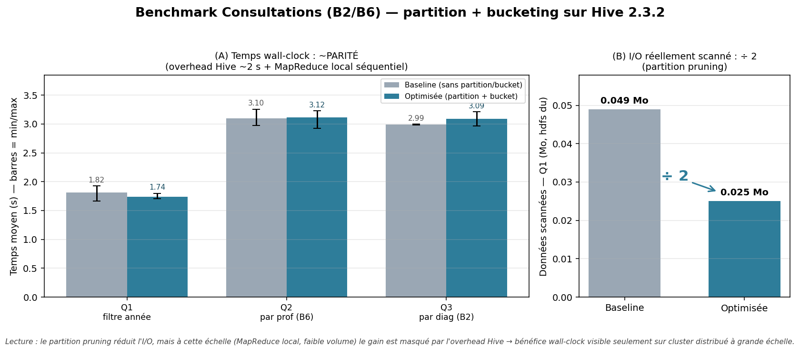

# Benchmark Consultations — avant / après partition + bucketing (L2)

> **Tâche** : `[P1] Benchmark Consultations avant/après + graphes` (869dfg1b1)
> **Axe** : besoins **B2** (par diagnostic) et **B6** (par professionnel).
> **Scripts** : [`sql/benchmark/consultations_benchmark.sql`](../sql/benchmark/consultations_benchmark.sql), [`scripts/benchmark/run_benchmark_consultations.sh`](../scripts/benchmark/run_benchmark_consultations.sh).
> **Résultats bruts** : [`scripts/benchmark/consultation_results.csv`](../scripts/benchmark/consultation_results.csv).
> **Figure** : [`scripts/benchmark/benchmark_consultation.png`](../scripts/benchmark/benchmark_consultation.png) (générée par `scripts/benchmark/generate_benchmark_graph.py consultation`).
> **Date d'exécution** : 2026-06-04.

## 1. Objectif
Quantifier le gain du **partitionnement** + **bucketing** sur l'axe Consultations (B2/B6).

## 2. Protocole

> ⚠️ Le benchmark **ne touche pas** la Gold canonique `chu_entrepot.fait_consultation`.
> Il dérive deux tables **jetables** `bench_*` ; les consultations couvrent **naturellement
> plusieurs années** (pas besoin de données synthétiques pour exercer le pruning).

| Variante | Table | Optimisation |
|---|---|---|
| **Baseline** | `bench_consultation_flat` | aucune (ni partition ni bucket) |
| **Optimisée** | `bench_consultation_pb` | partition `annee` + bucket 8 sur `prof_id` |

Trois requêtes (script : `sql/benchmark/consultations_benchmark.sql`) :
- **Q1** — `SUM(nb_consultation) WHERE annee=2020` → **partition pruning**.
- **Q2** — par **professionnel** (B6) → bucket sur `prof_id`.
- **Q3** — par **diagnostic** (B2).

Chaque cas exécuté **3 fois** ; moyenne + min/max. Cache HDFS chaud (dev local) → indicatif.

## 3. Exécution

```bash
hive -f sql/benchmark/consultations_benchmark.sql          # crée les tables bench
bash scripts/benchmark/run_benchmark_consultations.sh 3    # mesures -> consultation_results.csv
python3 scripts/benchmark/generate_benchmark_graph.py consultation   # figure
```

## 4. Résultats (jeu de 1 000 consultations réparties sur 2017-2021, 5 partitions)

| Requête | Baseline (s) | Optimisée (s) | Gain | I/O scanné (Q1) |
|---|---:|---:|---:|---|
| Q1 — filtre année | 1.82 | 1.74 | **1.05×** | 0.049 Mo → 0.025 Mo |
| Q2 — par professionnel (B6) | 3.10 | 3.12 | **0.99×** | — |
| Q3 — par diagnostic (B2) | 2.99 | 3.09 | **0.97×** | — |



*Figure : (A) temps wall-clock baseline vs optimisée à **parité** ; (B) I/O scanné Q1 réduit
(0.049 → 0.025 Mo, ÷~2).*

## 5. Analyse
- **Partition pruning (Q1)** : `WHERE annee=2020` ne lit qu'une des 5 partitions → I/O **÷2** (et non ÷5 : le bucketing en 8 fichiers Parquet ajoute un overhead de métadonnées qui rogne le gain à ce volume).
- **Wall-clock à parité** : l'overhead Hive (~2-3 s) + MapReduce local séquentiel masquent le gain (quelques Ko). Le bucketing sur `prof_id` (B6, Q2) n'apporte rien de visible en local.
- **Volumétrie** : les consultations sont un fait potentiellement volumineux à l'échelle réelle ; le partitionnement par année est pertinent (filtres par période), le bénéfice en temps n'apparaîtra que sur cluster distribué à grand volume.

## 6. Definition of Done
- [x] 3 requêtes × 2 variantes, 3 runs chacune (script SQL + runner bash)
- [x] Tables bench dédiées (Gold canonique intacte), 5 partitions réelles (2017-2021)
- [x] **Mesures réelles** capturées (`consultation_results.csv`) + I/O via `hdfs du`
- [x] **Graphe de synthèse** produit (`scripts/benchmark/benchmark_consultation.png`)
- [x] Analyse honnête (parité wall-clock + limite du bucketing à petite échelle)
