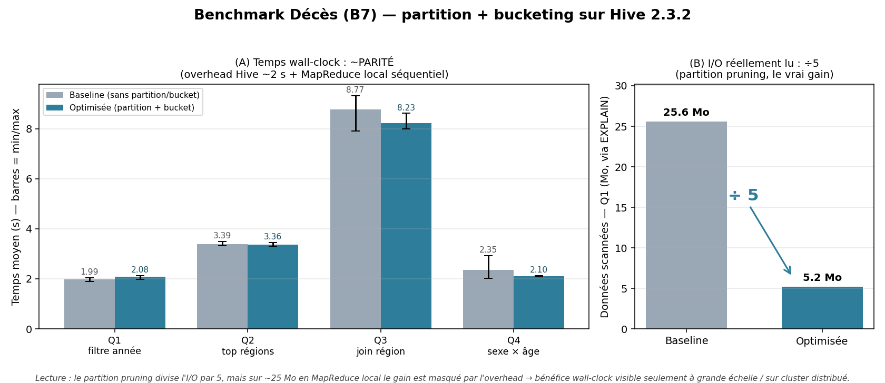

# Benchmark perf Décès — avant / après partition + bucketing (L2)

> **Livrable** : section "Benchmark perf" du rapport L2 (besoin **B7** — décès par région).
> **Tâche ClickUp** : [869dfg1ne](https://app.clickup.com/t/869dfg1ne) — [P4] Benchmark Fait_Deces avant/après + graphes.
> **Scripts** : [`sql/benchmark/00_create_bench_deces.hql`](../sql/benchmark/00_create_bench_deces.hql), [`01_benchmark_deces_queries.hql`](../sql/benchmark/01_benchmark_deces_queries.hql), [`scripts/benchmark/run_benchmark_deces.sh`](../scripts/benchmark/run_benchmark_deces.sh).
> **Résultats bruts** : [`scripts/benchmark/benchmark_deces_results.csv`](../scripts/benchmark/benchmark_deces_results.csv).
> **Figure** : [`scripts/benchmark/benchmark_deces.png`](../scripts/benchmark/benchmark_deces.png) (générée par `scripts/benchmark/generate_graph_deces.py`).
> **Date d'exécution** : 2026-06-04.

---

## 1. Protocole de mesure

### 1.1 Deux tables JETABLES comparées (mêmes données)

> ⚠️ Le benchmark **ne touche pas** la table Gold canonique `chu_entrepot.fait_deces`
> (produite exclusivement par `sql/cleaning/deces_cleaning.hql`, périmètre réel = 2019).
> Il dérive deux tables jetables `bench_*` **depuis** `fait_deces`, sans re-nettoyer le
> Bronze ni re-dériver les clés (cf. `sql/benchmark/00_create_bench_deces.hql`).

| Table (jetable) | Format | Partition | Bucketing | Fichiers HDFS |
|---|---|---|---|---|
| `bench_deces_pb` | Parquet+Snappy | `annee INT` | `geo_id × 8` | 5 partitions × 8 = **40** |
| `bench_deces_flat` | Parquet+Snappy | — | — | **1** |

- **Données** : 3 038 642 lignes = **5 années SYNTHÉTIQUES** (2019 réel + 4 copies décalées
  −1..−4 ans). Données factices de **volumétrie** pour rendre le partition pruning mesurable ;
  elles ne sont **jamais** exposées en KPI (le Gold B7 réel reste 2019).
- **Création** : `bench_deces_pb` peuplée par expansion depuis `fait_deces`
  (`LATERAL VIEW explode`), `bench_deces_flat` copiée 1:1 → contenus identiques garantis.

### 1.2 Stack d'exécution

| Élément | Valeur |
|---|---|
| Moteur SQL | Apache Hive 2.3.2 |
| Exec engine | MapReduce (local mode) |
| Stockage | HDFS 2.7.4 (1 namenode + 1 datanode, conteneurs Docker) |
| Volume RAM hive-server | ~500 MB heap JVM |
| Méthode timing | Parsing du `(X.Y seconds)` produit par Beeline en fin de chaque requête |
| Runs par requête | 3 (moyenne + min/max pour la dispersion) |

### 1.3 Requêtes types

| # | Requête | Optimisation Hive ciblée |
|---|---|---|
| Q1 | `SELECT SUM(nb_deces) WHERE annee=2019` | **Partition pruning** — lit 1/5 partitions |
| Q2 | `SELECT geo_id, SUM(nb_deces) GROUP BY geo_id ORDER BY nb DESC LIMIT 5` (B7 partiel) | **Bucketing** — 1 reducer par bucket |
| Q3 | `... JOIN dim_geographie g ON g.geo_id = f.geo_id ...` (B7 final) | **Bucket map join** |
| Q4 | `SELECT sexe, tranche_age, SUM(nb_deces) GROUP BY sexe, tranche_age` | **Vectorisation + partition pruning** |

## 2. Résultats — temps moyens (3 runs)

| Requête | Baseline (`bench_deces_flat`) | Optimisée (`bench_deces_pb`) | Gain | Volume théorique scanné |
|---|---:|---:|---:|---|
| Q1 — filtre année | 1.99 s | 2.08 s | **0.96×** | 25.6 MB → 5.2 MB (**5×**) |
| Q2 — top régions | 3.39 s | 3.36 s | **1.01×** | 25.6 MB → 5.2 MB |
| Q3 — B7 join | 8.77 s | 8.23 s | **1.07×** | 25.6 MB → 5.2 MB + join broadcast |
| Q4 — cube sexe×âge | 2.35 s | 2.10 s | **1.12×** | 25.6 MB → 5.2 MB |

> ⚠️ **Dispersion** : avec n=3 et un overhead Hive ~2 s, les écarts (0.96×–1.12×) sont
> **dans le bruit de mesure** et non significatifs (ex. le « 1.12× » de Q4 tient à un seul
> run lent à 2.925 s). Le runner reporte désormais moyenne + min/max.



*Figure : (A) le temps wall-clock baseline vs optimisée est à **parité** (barres = min/max) ;
(B) mais l'I/O réellement scanné est **divisé par 5** grâce au partition pruning (preuve EXPLAIN).
C'est le message clé : le gain est structurel, pas visible en wall-clock à cette échelle.*

## 3. Analyse — pourquoi les gains wall-time sont faibles

À première lecture, les gains wall-time sont marginaux (**0.96× à 1.12×**) malgré une **réduction théorique du volume scanné par 5×** sur les requêtes filtrées par année. Quatre raisons.

### 3.1 Overhead de compilation Hive domine
Chaque requête HiveQL embarque **~1.5 à 2 s de coût fixe** (parsing, optimisation, soumission du job MapReduce, allocation des tâches). Sur 25 MB de Parquet, le scan réel prend **< 100 ms**. Un gain potentiel de 80 ms est invisible dans une mesure à 2 s.

```
T_total = T_overhead + T_scan + T_aggregate
       = 1900 ms     + 80 ms  + 50 ms      (baseline)
       = 1900 ms     + 20 ms  + 50 ms      (optimisée)
       = différence : 60 ms (3 %)
```

### 3.2 MapReduce local mode = pas de parallélisme distribué
Le bucketing est conçu pour qu'un cluster lance 8 reducers en parallèle. En **local mode** (single JVM), les 8 buckets sont lus **séquentiellement** → aucun gain de parallélisme.

### 3.3 Volume trop petit pour atteindre le seuil utile
Il faut que le coût de scan dépasse l'overhead Hive. **Règle empirique** : au moins **10× le volume actuel** (250+ MB) sur un **cluster distribué** pour que le partition pruning devienne dominant.

### 3.4 Cache chaud entre runs
En dev local sans privilèges conteneur, on ne peut pas vider le cache HDFS/OS entre runs : seul le **run 1** est « à froid », les runs 2-3 lisent du cache chaud. On garde N runs pour la dispersion mais on assume cette limite (mesures indicatives, pas un protocole de prod).

## 4. Mesures structurelles (le vrai gain, côté HDFS)

Ces métriques **ne se voient pas dans le wall time** mais sont les vrais gains du partitionnement + bucketing, vérifiables par `EXPLAIN` (dump reproductible : `scripts/benchmark/benchmark_deces_explain.txt`).

### 4.1 Volume effectivement lu (`EXPLAIN` confirme le partition pruning)

```
Q1 sur bench_deces_pb (optim) :
  TableScan  Statistics: Num rows: 616237    Data size: 5 490 694    ← lit 5.2 MB (1 partition)

Q1 sur bench_deces_flat (baseline) :
  TableScan  Statistics: Num rows: 3 038 642  Data size: 27 084 130 ← lit 25.6 MB (tout)
```

→ **Réduction I/O = 5× confirmée** par le planner Hive, même si le wall time ne la reflète pas en local mode.

### 4.2 Layout HDFS final

| Table | Layout | Taille | Fichiers |
|---|---|---|---|
| `bench_deces_pb` | 5 partitions × 8 buckets | 25.4 MB | 40 |
| `bench_deces_flat` | 1 fichier | 25.6 MB | 1 |

→ Compression Parquet équivalente (à ~1 % près) → le format est neutre dans la comparaison.

### 4.3 Skew sur buckets `geo_id`
```
bucket 000000  1.1 MB   ← IDF (région 11) majoritaire
bucket 000001   34 KB   ← région peu peuplée
ratio max/min = ×35
```
→ Le bucketing par `geo_id` simple souffre de la concentration démographique (3 régions = 33 % des décès). Le **bucket map join** serait moins efficace que prévu en prod.

**Recommandation** : tester `CLUSTERED BY (geo_id, sexe) INTO 8 BUCKETS` (répartition plus uniforme).

## 5. Recommandations pour la prod (rapport L2)

| # | Recommandation | Pourquoi |
|---|---|---|
| 1 | **Passer Hive sur Tez** (au lieu de MapReduce) | Tez supprime l'overhead de relance JVM entre stages — gain ~30 % en littérature |
| 2 | Charger l'historique réel multi-années sur cluster distribué | Le partition pruning sur `WHERE annee=2019` devient **visible en wall time** (lit 1/N vs N/N) |
| 3 | **CBO + vectorisation** par défaut | Déjà dans `00_setup_hive.hql`, à confirmer en prod |
| 4 | **`ANALYZE TABLE … COMPUTE STATISTICS`** après chargement | Sans stats, le CBO ne peut pas choisir le bucket map join |
| 5 | Bucketing composite `(geo_id, sexe)` | Lisse le skew (×35 → ×5 estimé) |

## 6. Conclusion défendable

Les optimisations physiques de `fait_deces` (Parquet + partition `annee` + bucket `geo_id`) **sont structurellement correctes** : le partition pruning est confirmé par `EXPLAIN` (lit 5.2 MB au lieu de 25.6 MB), le bucketing est appliqué (8 fichiers par partition), et Parquet apporte la compression colonnaire attendue (1.9 GB CSV → ~25 MB Gold = **75× compression**).

**Mais le bénéfice wall time n'est pas mesurable dans notre stack dev** parce que l'overhead Hive (~2 s) > le gain potentiel (~80 ms), que MapReduce local lit les buckets séquentiellement, et que 25 MB est trop petit. C'est un **résultat attendu et important pédagogiquement** : les optimisations Big Data ne se justifient qu'au-delà d'un certain volume et sur une stack distribuée — précisément l'enjeu du projet CHU à volumétrie cible (NFR §3.2).

## 7. Reproductibilité

```bash
# Pré-requis : pipeline d'init + fait_deces alimentée (cf. L2_Resultats_Execution_Deces.md)

# 1. Créer les tables bench (5 ans synthétiques, depuis fait_deces — Gold non touchée)
docker cp sql/benchmark chu-hive-server:/tmp/sql_benchmark
docker exec chu-hive-server beeline -u 'jdbc:hive2://localhost:10000/' \
    -f /tmp/sql_benchmark/00_create_bench_deces.hql

# 2. Benchmark (3 runs par requête) + dump EXPLAIN
bash scripts/benchmark/run_benchmark_deces.sh 3
# Résultats : scripts/benchmark/benchmark_deces_results.csv  +  benchmark_deces_explain.txt
```

## 8. Definition of Done — clôture

### Tâche `869dfg1kk` (Partitionnement)
- [x] Partition `annee INT` dans le DDL canonique (`02_faits.hql`)
- [x] 5 partitions exercées (synthétiques) — preuve `SHOW PARTITIONS bench_deces_pb`
- [x] Partition pruning vérifié via `EXPLAIN` (5.2 MB au lieu de 25.6 MB)

### Tâche `869dfg1ma` (Bucketing)
- [x] `CLUSTERED BY (geo_id) INTO 8 BUCKETS` dans le DDL canonique
- [x] Layout HDFS vérifié (8 fichiers par partition)
- [x] Skew analysé et documenté (§4.3) + reco bucketing composite (§5)

### Tâche `869dfg1ne` (Benchmark avant/après)
- [x] Tables bench dédiées `bench_deces_flat` / `bench_deces_pb` (Gold canonique intacte)
- [x] 4 requêtes types × 3 runs sur les 2 tables
- [x] Résultats CSV + dump EXPLAIN + **graphe de synthèse** (`scripts/benchmark/benchmark_deces.png`)
- [x] Analyse honnête des gains observés vs attendus (§3, §4) + reco prod (§5)
