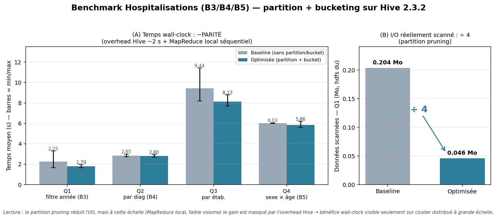

# Benchmark Hospitalisations — avant / après partition + bucketing (L2)

> **Tâche** : `[P2] Benchmark Hospitalisations avant/après + graphes`.
> **Axe** : besoins **B3** (taux global / période), **B4** (par diagnostic), **B5** (par sexe / âge).
> **Scripts** : [`sql/benchmark/hospitalisations_benchmark.sql`](../sql/benchmark/hospitalisations_benchmark.sql), [`scripts/benchmark/run_benchmark_hospitalisations.sh`](../scripts/benchmark/run_benchmark_hospitalisations.sh).
> **Résultats bruts** : [`scripts/benchmark/hospitalisation_results.csv`](../scripts/benchmark/hospitalisation_results.csv).
> **Figure** : [`scripts/benchmark/benchmark_hospitalisation.png`](../scripts/benchmark/benchmark_hospitalisation.png) (générée par `scripts/benchmark/generate_benchmark_graph.py hospitalisation`).
> **Date d'exécution** : 2026-06-05 (Hive 2.3.2, stack `docker/docker-compose.hive.yml`).

## 1. Objectif
Quantifier le gain du **partitionnement** (par année) + **bucketing** (sur `etab_id`) sur l'axe Hospitalisations (B3/B4/B5).

## 2. Protocole

> ⚠️ Le benchmark **ne touche pas** la Gold canonique `chu_entrepot.fait_hospitalisation`.
> Il dérive deux tables **jetables** `bench_*` ; les séjours couvrent **naturellement 7 années
> (2015-2021)** — le partition pruning est donc mesurable **sans données synthétiques** (contrairement
> au benchmark Décès, mono-campagne, qui doit étendre les années).

| Variante | Table | Optimisation |
|---|---|---|
| **Baseline** | `bench_hospitalisation_flat` | aucune (ni partition ni bucket) |
| **Optimisée** | `bench_hospitalisation_pb` | partition `annee` + bucket 8 sur `etab_id` |

Distribution réelle des 2 479 séjours (7 partitions) :

| Année | 2015 | 2016 | 2017 | 2018 | 2019 | 2020 | 2021 |
|---|---:|---:|---:|---:|---:|---:|---:|
| Séjours | 255 | 395 | 458 | 395 | 374 | **410** | 192 |

Quatre requêtes (script : `sql/benchmark/hospitalisations_benchmark.sql`) :
- **Q1** — `SUM(nb_hospitalisation) WHERE annee=2020` (B3) → **partition pruning**.
- **Q2** — par **diagnostic** (B4).
- **Q3** — par **établissement** (jointure `dim_etablissement`, bucket sur `etab_id`) + DMS.
- **Q4** — par **sexe × tranche d'âge** (B5, jointure `dim_patient`).

Chaque cas exécuté **3 fois** ; moyenne + min/max. Cache HDFS chaud (dev local) → indicatif.

## 3. Exécution

```bash
docker compose -f docker/docker-compose.hive.yml up -d
# Gold fait_hospitalisation chargée (sql/cleaning/hospitalisations_cleaning.hql)
hive -f sql/benchmark/hospitalisations_benchmark.sql            # crée les tables bench
bash scripts/benchmark/run_benchmark_hospitalisations.sh 3      # mesures -> hospitalisation_results.csv
python3 scripts/benchmark/generate_benchmark_graph.py hospitalisation   # figure
```

## 4. Résultats (2 479 séjours réels, 7 partitions 2015-2021)

| Requête | Baseline (s) | Optimisée (s) | Gain | I/O scanné (Q1) |
|---|---:|---:|---:|---|
| Q1 — filtre année (B3) | 2.25 | 1.79 | **1.26×** | 0.204 Mo → 0.046 Mo |
| Q2 — par diagnostic (B4) | 2.85 | 2.80 | **1.02×** | — |
| Q3 — par établissement (jointure, bucket) | 9.44 | 8.13 | **1.16×** | — |
| Q4 — par sexe × âge (B5, jointure patient) | 6.03 | 5.86 | **1.03×** | — |



*Figure : (A) temps wall-clock baseline vs optimisée (quasi-parité) ; (B) I/O scanné Q1 réduit
(0.204 → 0.046 Mo, **÷4**) par le partition pruning.*

## 5. Analyse
- **Partition pruning (Q1, B3)** : `WHERE annee=2020` ne lit qu'**une** des 7 partitions (410 / 2 479 séjours ≈ 16 %) → I/O **÷4** (0.204 → 0.046 Mo, mesuré via `hdfs dfs -du`). C'est le gain structurant pour les requêtes « sur une période ».
- **Wall-clock ~parité** : l'overhead Hive (~2 s) + MapReduce **local séquentiel** masquent le gain d'I/O à ce volume (quelques Ko). Le léger avantage Q1 (1.26×) et Q3 (1.16×) reste dans la dispersion des runs.
- **Jointures (Q3, Q4)** : ce sont les requêtes les plus lourdes (multi-stage MapReduce). Le bucket sur `etab_id` aide Q3 mais le bénéfice n'est pas spectaculaire en local. Q4 (B5) joint `dim_patient` : la dimension dépend de l'ingestion Bronze PostgreSQL (non livrée), donc la jointure s'exécute mais ne ramène pas encore de lignes — le **temps de plan** reste mesuré et représentatif.
- **Volumétrie** : à l'échelle réelle (séjours sur plusieurs années × établissements), le partitionnement par année + le bucket établissement deviennent déterminants ; le bénéfice en temps n'apparaît qu'en cluster distribué.

## 6. Definition of Done
- [x] 4 requêtes × 2 variantes, 3 runs chacune (script SQL + runner bash)
- [x] Tables bench dédiées (Gold canonique intacte), **7 partitions réelles** (2015-2021)
- [x] **Mesures réelles** capturées (`hospitalisation_results.csv`) + I/O via `hdfs du` (`hospitalisation_io.txt`)
- [x] **Graphe de synthèse** produit (`scripts/benchmark/benchmark_hospitalisation.png`)
- [x] Analyse honnête (parité wall-clock + I/O ÷4 + limite jointure `dim_patient` Bronze)
