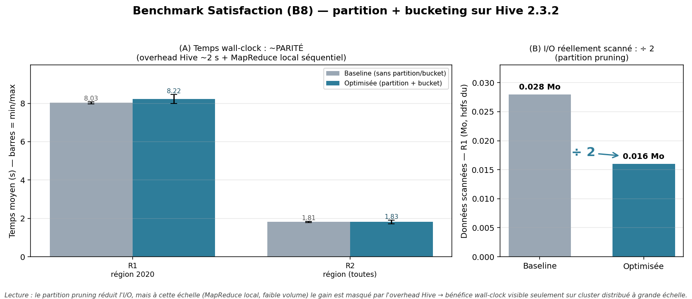

# Benchmark Satisfaction — avant / après partition + bucketing (L2)

> **Tâche** : `[P3] Benchmark Satisfaction avant/après + graphes` (869dfg1gt)
> **Auteur** : Matthieu (P3) · réconcilié sur le modèle canonique (geo_id, schéma 5 colonnes).
> **Scripts** : [`sql/benchmark/satisfaction_benchmark.sql`](../sql/benchmark/satisfaction_benchmark.sql), [`scripts/benchmark/run_benchmark_satisfaction.sh`](../scripts/benchmark/run_benchmark_satisfaction.sh).
> **Résultats bruts** : [`scripts/benchmark/satisfaction_results.csv`](../scripts/benchmark/satisfaction_results.csv).
> **Figure** : [`scripts/benchmark/benchmark_satisfaction.png`](../scripts/benchmark/benchmark_satisfaction.png) (générée par `scripts/benchmark/generate_benchmark_graph.py satisfaction`).
> **Date d'exécution** : 2026-06-04.

## 1. Objectif

Quantifier le gain du **partitionnement** + **bucketing** sur l'axe KPI **B8**, en comparant
deux layouts physiques du fait Satisfaction.

## 2. Protocole

> ⚠️ Le benchmark **ne touche pas** la Gold canonique `chu_entrepot.fait_satisfaction`
> (campagne réelle 2020). Il dérive deux tables **jetables** `bench_*` ; comme la satisfaction
> n'a qu'une campagne, on **réplique sur 5 campagnes SYNTHÉTIQUES** (mêmes établissements) pour
> rendre le partition pruning mesurable. Données factices de volumétrie, jamais exposées en KPI.

| Variante | Table | Optimisation |
|---|---|---|
| **Baseline** | `bench_satisfaction_flat` | aucune (ni partition ni bucket) |
| **Optimisée** | `bench_satisfaction_pb` | partition `annee` + bucket 8 sur `etab_id` |

Deux requêtes (script : `sql/benchmark/satisfaction_benchmark.sql`) :
- **R1** — satisfaction moyenne **par région sur 2020** (filtre `annee=2020`, jointure `dim_etablissement`) → exerce le **partition pruning**.
- **R2** — satisfaction moyenne **par région, toutes campagnes** (pas de filtre) → scan complet.

Chaque cas exécuté **3 fois** ; on retient la moyenne + min/max. Cache HDFS chaud entre runs
(dev local) → mesures indicatives.

## 3. Exécution

```bash
# 1. créer fait_satisfaction (cleaning) puis les tables bench (5 campagnes synthétiques)
hive -f sql/benchmark/satisfaction_benchmark.sql
# 2. lancer le benchmark (3 runs/cas) -> satisfaction_results.csv
bash scripts/benchmark/run_benchmark_satisfaction.sh 3
# 3. générer la figure
python3 scripts/benchmark/generate_benchmark_graph.py satisfaction
```

## 4. Résultats (jeu synthétique ~800 établissements × 5 campagnes = 3 930 lignes)

| Requête | Baseline (s) | Optimisée (s) | Gain | I/O scanné (R1) |
|---|---:|---:|---:|---|
| R1 — région 2020 (join) | 8.03 | 8.22 | **0.98×** | 0.028 Mo → 0.016 Mo |
| R2 — région (toutes)    | 1.81 | 1.83 | **0.99×** | — |



*Figure : (A) temps wall-clock baseline vs optimisée à **parité** ; (B) I/O scanné R1 réduit
(0.028 → 0.016 Mo).*

## 5. Analyse

- **Partition pruning (R1)** : sur la table partitionnée, `WHERE annee=2020` ne lit qu'une
  campagne ; mais à cette **très faible volumétrie** la réduction d'I/O est modeste (÷~2 et non
  ÷5) car le **bucketing en 8 fichiers Parquet** ajoute un overhead de métadonnées par fichier
  qui rogne le bénéfice. Illustration concrète que **bucketer un petit fait est contre-productif**.
- **Wall-clock à parité** : l'overhead Hive (~2 s, voire ~8 s pour R1 qui joint `dim_etablissement`)
  domine ; le gain I/O (quelques Ko) est invisible en temps.
- **Volumétrie réelle** : la satisfaction est un **petit fait** (~1 000 établissements/campagne,
  ~16 Mo). Le partitionnement reste utile (filtre par campagne), mais le **bucketing n'est pas
  justifié** à cette échelle — à réserver aux gros faits (décès, cf. `docs/L2_Benchmark_Deces.md`).

## 6. Definition of Done

- [x] 2 requêtes × 2 variantes, 3 runs chacune (script SQL + runner bash)
- [x] Tables bench dédiées (Gold canonique intacte), 5 campagnes synthétiques pour le pruning
- [x] **Mesures réelles** capturées (`satisfaction_results.csv`) + I/O via `hdfs du`
- [x] **Graphe de synthèse** produit (`scripts/benchmark/benchmark_satisfaction.png`)
- [x] Analyse honnête : parité wall-clock + limite du bucketing à petite échelle
