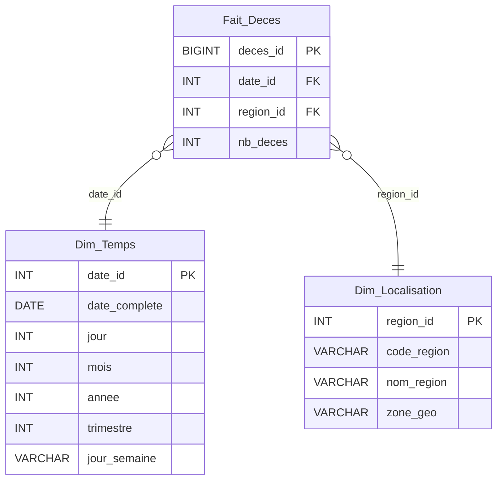

# Modélisation Fait_Deces (P4)

> **Livrable** : section "Fait_Deces" du rapport L1.
> **Tâche ClickUp** : [869dfg131](https://app.clickup.com/t/869dfg131) — [P4] Modélisation Fait_Deces.
> **KPI couvert** : KPI 8 — Nombre de décès par région sur l'année 2019.

---

## 1. Contexte

La source est le **répertoire des décès de l'INSEE**, un fichier officiel volumineux (~600 000 lignes par an) qui recense l'ensemble des décès enregistrés en France. Contrairement aux autres faits (consultations, hospitalisations, satisfaction), ces données **ne sont pas reliées aux patients ou établissements du groupe CHU** : il s'agit d'un référentiel national exogène, utilisé ici pour fournir un indicateur de **contexte régional**.

Le seul KPI ciblé par cette table de faits est :

> **KPI 8** — *Nombre de décès par localisation (région) sur l'année 2019.*

---

## 2. Granularité

**1 ligne de `Fait_Deces` = 1 décès enregistré par l'INSEE.**

Ce choix est dicté par la nature de la source (un enregistrement par décès) et offre la granularité la plus fine possible, ce qui permet d'agréger ensuite par n'importe quelle dimension (région, année, mois, sexe…) sans perte d'information.

---

## 3. Mesure

| Mesure | Type | Description | Agrégation |
|---|---|---|---|
| `nb_deces` | `INT` | Compteur (= 1 sur chaque ligne) | `SUM` ou `COUNT(*)` |

Une seule mesure additive : `nb_deces`. Cette mesure permet de répondre au KPI 8 par simple agrégation.

> **Remarque** : on pourrait préagréger en `1 ligne = 1 (région, date)` avec `nb_deces` = nombre de décès, ce qui réduirait drastiquement la volumétrie. Choix écarté pour conserver la granularité fine et permettre de futurs croisements (par sexe, âge, jour de la semaine, etc.).

---

## 4. Dimensions

| Dimension (FK) | Cible | Rôle |
|---|---|---|
| `date_id` | `Dim_Temps` | Date du décès (jour, mois, année) |
| `region_id` | `Dim_Localisation` | Région INSEE du lieu de décès |

### Dimensions **non liées** (et justification)

- ❌ **`Dim_Patient`** : les décès INSEE ne sont pas reliés aux patients hospitaliers du CHU. Aucune clé commune fiable (pas de numéro de sécurité sociale dans nos données patient).
- ❌ **`Dim_Etablissement`** : un décès peut survenir hors établissement (domicile, voie publique, EHPAD…). Lier à `Dim_Etablissement` introduirait massivement des valeurs `NULL` ou une fausse clé "inconnu" qui fausserait les analyses.

---

## 5. Décision — Dim_Localisation vs enrichissement Dim_Etablissement

Le sujet impose une dimension géographique. Deux options se présentaient :

| Option | Description | Pour | Contre |
|---|---|---|---|
| **A** ✅ | Créer une **`Dim_Localisation`** dédiée (table région INSEE) | Sépare proprement les concepts ; cohérent avec la nature exogène des données INSEE ; réutilisable pour d'autres faits | Une dimension de plus à maintenir |
| **B** | Enrichir **`Dim_Etablissement`** avec les régions | Pas de table supplémentaire | Mélange "établissement de soins" et "découpage administratif" ; force à créer des "faux établissements" pour les régions sans CHU ; viole la séparation des concepts |

> **Choix retenu : Option A.**
> Justification : la `Dim_Localisation` est un référentiel administratif autonome (régions INSEE), qui peut aussi servir à d'autres analyses (KPI 7 — satisfaction par région — par exemple). Elle évite la confusion conceptuelle de l'option B et reste compatible avec un futur enrichissement (département, commune).

---

## 6. Schéma en étoile



### Représentation textuelle (fallback rapport)

```
                ┌────────────────────┐
                │     Dim_Temps      │
                │  date_id (PK)      │
                │  date_complete     │
                │  jour, mois, année │
                └─────────┬──────────┘
                          │
                          │ date_id (FK)
                          │
                ┌─────────▼──────────┐
                │     Fait_Deces     │
                │  deces_id (PK)     │
                │  date_id (FK)      │
                │  region_id (FK)    │
                │  nb_deces          │
                └─────────┬──────────┘
                          │
                          │ region_id (FK)
                          │
                ┌─────────▼──────────┐
                │  Dim_Localisation  │
                │  region_id (PK)    │
                │  code_region       │
                │  nom_region        │
                │  zone_geo          │
                └────────────────────┘
```

---

## 7. Requête type pour le KPI 8

```sql
SELECT
    l.nom_region,
    SUM(f.nb_deces) AS nb_total_deces
FROM Fait_Deces f
JOIN Dim_Temps t        ON f.date_id   = t.date_id
JOIN Dim_Localisation l ON f.region_id = l.region_id
WHERE t.annee = 2019
GROUP BY l.nom_region
ORDER BY nb_total_deces DESC;
```

---

## 8. Mapping vers le besoin utilisateur

| Élément | Référence |
|---|---|
| Persona concerné | **Mme Durand** (directrice CHU) — besoin B2.4 |
| Besoin métier | Mettre en perspective la mortalité régionale avec l'activité hospitalière locale |
| KPI couvert | KPI 8 — Nb décès par région / 2019 |
| Source alimentation | Fichiers plats INSEE (répertoire des décès) |

*(Voir `personas_besoins.md` §3 pour le mapping complet.)*

---

## 9. Volumétrie estimée

| Élément | Estimation |
|---|---|
| Lignes / an | ~600 000 |
| Périmètre L1 | 1 année (2019) → ~600 000 lignes |
| Taille brute (CSV INSEE) | ~50-80 Mo / an |
| Périmètre étendu (5 ans, post-MVP) | ~3 M lignes |

> Cette volumétrie justifie le **partitionnement par année** prévu au Livrable 2 (tâche [869dfg1kk](https://app.clickup.com/t/869dfg1kk)).

---

## 10. Definition of Done

- [x] Mesure et granularité définies
- [x] Choix Option A vs B justifié (Option A retenue)
- [x] Schéma en étoile dessiné
- [x] Mapping KPI 8 validé
- [ ] Section "Fait_Deces" intégrée au rapport L1
- [ ] Relecture par l'équipe

---

## 11. Dépendances & suite

**Prérequis** :
- `[COMMUN] Modélisation des dimensions partagées` ([869dfg0v4](https://app.clickup.com/t/869dfg0v4)) — pour valider que `Dim_Temps` et `Dim_Localisation` sont cohérentes avec les autres axes.

**Débloque** :
- `[P4] DDL Fait_Deces` ([869dfg1jp](https://app.clickup.com/t/869dfg1jp)) — passage à l'implémentation Hive.
- `[P4] Description job ETL Décès` ([869dfg13p](https://app.clickup.com/t/869dfg13p)) — description du job d'alimentation.
